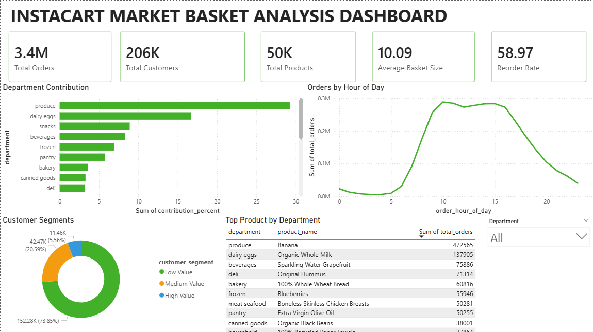
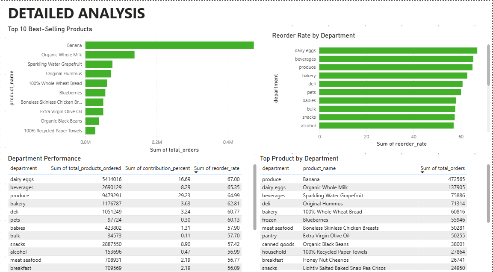

# 🛒 Instacart Market Basket Analysis using PostgreSQL & Power BI

# 📌 Project Overview

This project analyzes customer purchasing behavior using the **Instacart Online Grocery Shopping Dataset**. The analysis was performed using **PostgreSQL** for data processing and **Power BI** for visualization, following a complete end-to-end data analytics workflow.

The project transforms raw transactional data into meaningful business insights by exploring customer behavior, product performance, department contribution, reorder patterns, and shopping trends.

---

# 🎯 Business Problem

Instacart processes millions of grocery orders, making it challenging to understand customer purchasing behavior and optimize business operations.

This project answers key business questions such as:

- Which products are ordered most frequently?
- Which departments contribute the highest order volume?
- Which departments have the highest reorder rates?
- When do customers shop the most?
- How are customers distributed based on purchase frequency?
- Which products perform best within each department?

The insights generated support inventory planning, customer retention, marketing strategies, and operational decision-making.

---

# 🛠️ Tools & Technologies

- PostgreSQL
- SQL
- Power BI Desktop
- DAX
- Git & GitHub
- Markdown
- CSV Dataset

---

# 📂 Project Workflow

```text
Raw CSV Files
        ↓
PostgreSQL Database Setup
        ↓
Data Validation
        ↓
Data Cleaning
        ↓
Exploratory Data Analysis (EDA)
        ↓
Business Analysis
        ↓
Reporting Views
        ↓
Power BI Dashboard
```

---

# 📊 Power BI Dashboard

The dashboard consists of two interactive report pages.

## Executive Overview

- Total Orders
- Total Customers
- Total Products
- Average Basket Size
- Reorder Rate
- Department Contribution
- Orders by Hour of Day
- Customer Segments
- Top Product by Department



---

## Detailed Analysis

- Top 10 Best-Selling Products
- Reorder Rate by Department
- Department Performance
- Top Product by Department



---

# 📈 Key Business Insights

- Customers purchase an average of **10.09** products per order.
- Nearly **59%** of purchased products are reordered.
- Produce contributes the largest share of total product orders.
- Dairy & Eggs has the highest department reorder rate.
- Shopping activity peaks between **10:00 AM and 3:00 PM**.
- Fresh produce products dominate the list of best-selling items.
- Most customers belong to the **Low Value** customer segment.

---

# 📁 Repository Structure

```text
Instacart-Market-Basket-Analysis/
│
├── Dataset/
│
├── SQL/
│   ├── 01_database_setup.sql
│   ├── 02_data_validation.sql
│   ├── 03_data_cleaning.sql
│   ├── 04_exploratory_analysis.sql
│   ├── 05_business_analysis.sql
│   └── 06_views.sql
│
├── Documentation/
│   ├── Project Overview.md
│   ├── Data Dictionary.md
│   ├── Data Validation Report.md
│   ├── EDA Findings.md
│   ├── Business Questions.md
│   ├── Business Insights.md
│   └── Dashboard.md
│
├── PowerBI/
│   ├── Instacart_Market_Basket_Analysis.pbix
│   ├── Instacart_Market_Basket_Analysis.pdf
│   ├── Executive.overview.png
│   └── Detailed.analysis.png
│
└── README.md
```

---

# 📄 Documentation

The repository includes comprehensive project documentation:

- Project Overview
- Data Dictionary
- Data Validation Report
- Exploratory Data Analysis (EDA) Findings
- Business Questions
- Business Insights
- Dashboard Documentation

---

# 🚀 Skills Demonstrated

## SQL

- Database Creation
- Data Validation
- Data Cleaning
- Joins
- Aggregate Functions
- Common Table Expressions (CTEs)
- Window Functions
- CASE Statements
- Reporting Views

## Power BI

- DAX Measures
- KPI Cards
- Bar Charts
- Line Charts
- Donut Charts
- Tables
- Dashboard Design
- Data Modeling
- Interactive Slicers
- Data Visualization

## Business Analytics

- Customer Behavior Analysis
- Product Performance Analysis
- Department Performance Analysis
- Customer Segmentation
- Reorder Analysis
- Trend Analysis
- Business Insight Generation

---

# 📌 Dataset

**Source:** Instacart Online Grocery Shopping Dataset

The dataset contains over **3.4 million grocery orders**, **206,209 customers**, and **49,688 products**, making it suitable for large-scale customer behavior analysis.

---

# 📬 Contact

If you have any questions or feedback about this project, feel free to connect with me through GitHub or LinkedIn.

⭐ **If you found this project useful or interesting, consider giving the repository a star.**
